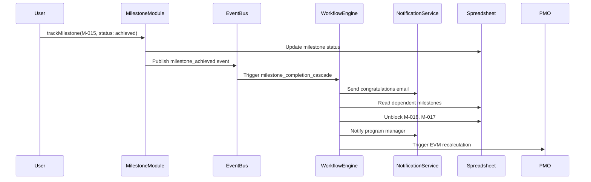
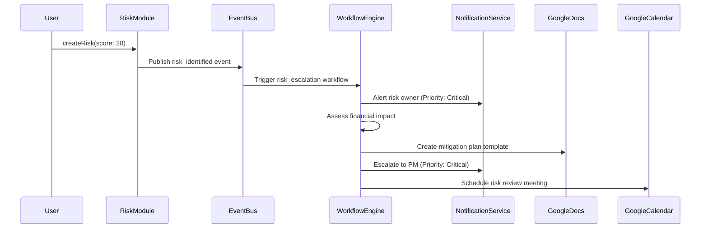

# Week 7: Workflow Integration Documentation

## Overview

Week 7 implements comprehensive workflow integration across all completed Program Management and PMO domains, enabling automated event-driven responses to key program activities.

## Implemented Features

### 1. Event Emission Integration

Event emissions have been added to critical operations across multiple modules to trigger automated workflows.

#### Program Module Events

**Milestones Module** ([src/program/milestones.ts](../src/program/milestones.ts))

| Event Type | Trigger | Payload | Purpose |
|------------|---------|---------|---------|
| `milestone_created` | New milestone created | milestoneId, name, targetDate, owner, critical | Track new milestones |
| `milestone_achieved` | Milestone status → achieved | milestoneId, name, owner, actualDate, critical, deliverables | Trigger completion workflows |
| `milestone_at_risk` | Milestone status → at_risk | milestoneId, name, owner, targetDate, critical | Escalate at-risk milestones |

**Change Control Module** ([src/program/change-control.ts](../src/program/change-control.ts))

| Event Type | Trigger | Payload | Purpose |
|------------|---------|---------|---------|
| `change_request_approved` | Change request approved | changeId, title, category, priority, approver, affectedDeliverables, affectedMilestones | Initiate implementation |
| `change_request_rejected` | Change request rejected | changeId, title, requestedBy, approver, comments | Notify requestor |
| `change_implemented` | Change marked as implemented | changeId, title, category, implementationDate, affectedItems | Update program status |

#### PMO Module Events

**Deliverables Module** ([src/pmo/deliverables.ts](../src/pmo/deliverables.ts))

| Event Type | Trigger | Payload | Purpose |
|------------|---------|---------|---------|
| `deliverable_completed` | Deliverable status → complete | deliverableId, name, wbs, responsible, qualityScore | Update metrics |
| `deliverable_quality_issue` | Quality score < 50 | deliverableId, name, responsible, qualityScore, notes | Initiate quality improvement |

**Risks Module** ([src/pmo/risks.ts](../src/pmo/risks.ts))

| Event Type | Trigger | Payload | Purpose |
|------------|---------|---------|---------|
| `risk_identified` | New risk with score ≥ 15 | riskId, name, category, probability, impact, score, owner | Escalate high-severity risks |
| `risk_closed` | Risk closed | riskId, name, category, owner | Track risk resolution |

### 2. Workflow Definitions

Six new comprehensive workflow definitions have been created to automate program management processes.

#### Program Workflows ([src/workflows/definitions/program-workflows.ts](../src/workflows/definitions/program-workflows.ts))

##### 1. Milestone Completion Cascade

**ID:** `milestone_completion_cascade`
**Trigger:** `milestone_achieved` event
**Priority:** 8 (High)

**Actions:**
1. **Congratulate Milestone Owner** - Send congratulations email
2. **Check Dependencies** - Read milestone dependencies from spreadsheet
3. **Unblock Dependents** - Update status of dependent milestones
4. **Notify Program Manager** - Inform PM of completion and impact
5. **Trigger EVM Update** - Recalculate EVM with updated progress

**Use Case:** When Milestone M-015 is achieved, automatically check if M-016 and M-017 depend on it, unblock them, notify all parties, and update program metrics.

##### 2. Change Request Approval

**ID:** `change_request_approval`
**Trigger:** `change_request_approved` event
**Priority:** 7 (High)

**Actions:**
1. **Notify Requestor** - Inform requestor of approval
2. **Assess Impact** - Analyze impact on affected deliverables/milestones
3. **Update Schedule** - Modify master schedule if schedule change
4. **Create Implementation Tasks** - Generate follow-up tasks
5. **Notify Stakeholders** - Inform affected stakeholders

**Use Case:** When Change Request CR-008 is approved for a schedule change, automatically update the schedule, create implementation tasks, and notify all affected stakeholders.

#### PMO Workflows ([src/workflows/definitions/pmo-workflows.ts](../src/workflows/definitions/pmo-workflows.ts))

##### 3. Risk Escalation

**ID:** `risk_escalation`
**Trigger:** `risk_identified` event (score ≥ 15)
**Priority:** 9 (Critical)

**Actions:**
1. **Notify Risk Owner** - Alert owner with immediate action requirements
2. **Assess Financial Impact** - Calculate potential financial impact
3. **Create Mitigation Template** - Generate mitigation plan document
4. **Escalate to PM** - Notify program manager of critical risk
5. **Schedule Risk Review** - Create calendar event for review meeting

**Use Case:** When Risk R-042 is identified with score 20 (probability=4, impact=5), immediately notify the owner, escalate to PM, and schedule a review meeting within 48 hours.

##### 4. Deliverable Quality Issue

**ID:** `deliverable_quality_issue`
**Trigger:** `deliverable_quality_issue` event (score < 50)
**Priority:** 8 (High)

**Actions:**
1. **Notify Responsible** - Alert responsible party with quality feedback
2. **Create Improvement Plan** - Generate quality improvement template
3. **Notify Accountable** - Inform team lead/accountable party
4. **Schedule Quality Review** - Create review meeting for reworked deliverable
5. **Track Rework** - Log quality issue for trend analysis

**Use Case:** When Deliverable D-125 receives quality score of 42, automatically notify the responsible party, create an improvement plan, notify their team lead, and schedule a review in 3 days.

#### Deliverable Workflows ([src/workflows/definitions/deliverable-workflows.ts](../src/workflows/definitions/deliverable-workflows.ts))

##### 5. Deliverable Completion

**ID:** `deliverable_completion`
**Trigger:** `deliverable_completed` event
**Priority:** 6 (Medium)

**Actions:**
1. **Congratulate Responsible** - Send congratulations email
2. **Update Milestone Progress** - Update linked milestone progress
3. **Trigger EVM Recalculation** - Update Earned Value
4. **Archive to PARA** - Archive to PARA system (if enabled)
5. **Update Dashboard** - Refresh stakeholder dashboard metrics

**Use Case:** When Deliverable D-089 is completed, congratulate the owner, update the linked milestone M-023 progress from 60% to 80%, recalculate EV, and update the dashboard.

##### 6. Milestone Deliverable Tracking

**ID:** `milestone_deliverable_tracking`
**Trigger:** `milestone_at_risk` event
**Priority:** 9 (Critical)

**Actions:**
1. **Identify Linked Deliverables** - Find all deliverables for this milestone
2. **Check Deliverable Status** - Assess completion status
3. **Notify Deliverable Owners** - Alert owners with urgency
4. **Create Urgency Tasks** - Generate follow-up tracking tasks
5. **Escalate if Critical** - Notify PM if on critical path

**Use Case:** When critical path Milestone M-030 becomes at-risk, identify that Deliverables D-201 and D-202 are blocking, notify their owners with urgent status, and escalate to the PM.

### 3. Event Bus Integration

All modules now use the shared event bus from `@gw-mcp/shared-workflows`:

```typescript
import { getDefaultEventBus } from "@gw-mcp/shared-workflows";

// Emit event
const eventBus = getDefaultEventBus();
await eventBus.publish({
  eventType: "milestone_achieved",
  source: "program_milestones",
  timestamp: new Date(),
  programId: "PROG-001",
  data: {
    milestoneId: "M-015",
    name: "Requirements Complete",
    owner: "alice@company.com",
    actualDate: new Date(),
    critical: true,
  },
});
```

**Event Bus Features:**
- In-memory EventEmitter backend (default)
- Redis backend support (future)
- Event filtering and retry logic
- Wildcard subscriptions
- Error handling

## Workflow Execution Flow

### Example: Milestone Achievement



### Example: Risk Escalation



## Event Payload Standards

All events follow a consistent payload structure:

```typescript
interface EventPayload {
  eventType: string;           // e.g., "milestone_achieved"
  source: string;              // e.g., "program_milestones"
  timestamp: Date;             // When event occurred
  programId?: string;          // Optional program context
  userId?: string;             // Optional user context
  data: Record<string, any>;   // Event-specific data
  metadata?: Record<string, any>;  // Optional metadata
}
```

## Workflow Registry

All workflows are registered in [src/workflows/definitions/index.ts](../src/workflows/definitions/index.ts):

```typescript
export const PREDEFINED_WORKFLOWS: WorkflowDefinition[] = [
  // Original workflows
  documentSubmissionWorkflow,
  deliverableReviewWorkflow,
  weeklyStatusWorkflow,
  milestoneNotificationWorkflow,
  // Week 7 additions
  milestoneCompletionCascade,
  changeRequestApproval,
  riskEscalation,
  deliverableQualityIssue,
  deliverableCompletion,
  milestoneDeliverableTracking,
];
```

**Helper Functions:**
- `getWorkflowDefinition(workflowId)` - Get workflow by ID
- `listWorkflowDefinitions()` - List all workflows
- `getWorkflowsByTriggerType(type)` - Filter by trigger type
- `getWorkflowsByCategory(category)` - Filter by category

## Testing Workflows

### Manual Testing

To manually trigger a workflow:

1. **Trigger the source event:**
   ```typescript
   // Example: Complete a milestone
   await trackMilestone(auth, "M-015", {
     status: "achieved",
     actualDate: new Date(),
   });
   ```

2. **Verify event emission:**
   - Check console logs for event publication
   - Verify event payload contains expected data

3. **Check workflow execution:**
   - Verify notifications sent
   - Check spreadsheet updates
   - Confirm cascade effects

### Automated Testing

Create test scenarios for each workflow:

```typescript
describe("Milestone Completion Cascade", () => {
  it("should unblock dependent milestones when milestone achieved", async () => {
    // Setup: Create milestone M-015 with dependents M-016, M-017
    // Action: Mark M-015 as achieved
    // Assert: M-016 and M-017 status updated to in_progress
  });

  it("should notify milestone owner and PM", async () => {
    // Setup: Create milestone M-015
    // Action: Mark M-015 as achieved
    // Assert: Emails sent to owner and PM
  });

  it("should trigger EVM recalculation", async () => {
    // Setup: Create milestone M-015 with budget
    // Action: Mark M-015 as achieved
    // Assert: EVM snapshot created with updated EV
  });
});
```

## Configuration

### Environment Variables

Required environment variables for workflow execution:

```bash
# Spreadsheet IDs
PROGRAM_SPREADSHEET_ID=...
PMO_SPREADSHEET_ID=...

# Notification Recipients
PROGRAM_MANAGERS=pm@company.com,lead@company.com
PROGRAM_STAKEHOLDERS=stakeholder1@company.com,stakeholder2@company.com
QUALITY_MANAGERS=qa@company.com
WEEKLY_REPORT_RECIPIENTS=team@company.com
```

### Workflow Configuration

Each workflow can be enabled/disabled and prioritized:

```typescript
{
  workflowId: "risk_escalation",
  enabled: true,            // Enable/disable workflow
  priority: 9,              // 1-10 (10=highest priority)
  timeout: 300,             // Timeout in seconds
  retryPolicy: {
    maxRetries: 3,          // Retry failed actions
    retryDelay: 5,          // Delay between retries (seconds)
    backoffMultiplier: 2,   // Exponential backoff
  },
}
```

## Monitoring and Debugging

### Event Logs

All events are logged with:
- Event type
- Source module
- Timestamp
- Payload data

### Workflow Execution Logs

Track workflow execution:
- Workflow ID
- Trigger event
- Action execution status
- Errors and retries
- Completion time

### Common Issues

**Issue: Events not triggering workflows**
- Check event bus is initialized: `getDefaultEventBus()`
- Verify event type matches workflow trigger
- Confirm workflow is enabled

**Issue: Notifications not sent**
- Verify email recipients in environment variables
- Check Gmail API permissions
- Review notification action configuration

**Issue: Spreadsheet updates failing**
- Verify spreadsheet IDs in environment
- Check Google Sheets API permissions
- Confirm column mappings are correct

## Performance Considerations

### Event Bus Performance

- **In-memory EventEmitter**: Suitable for single-server deployments
- **Max listeners**: Set to 100 (can be increased if needed)
- **Async execution**: All event handlers run asynchronously

### Workflow Execution

- **Parallel actions**: Independent actions can execute in parallel
- **Timeouts**: Each workflow has 300s timeout
- **Retries**: Failed actions retry up to 3 times with exponential backoff

### Scalability

For high-volume event processing:
1. Switch to Redis event bus backend
2. Implement event queue for async processing
3. Add workflow execution monitoring
4. Scale workflow executors horizontally

## Future Enhancements

### Week 8+ Additions

1. **Notification Delivery**
   - Email via Gmail API ✅ (Defined in workflows)
   - Calendar events via Google Calendar API ✅ (Defined in workflows)
   - Implementation pending

2. **Additional Workflows**
   - Weekly status compilation (existing)
   - Document submission routing (existing)
   - Deliverable review automation (existing)

3. **Advanced Features**
   - Workflow versioning
   - A/B testing of workflows
   - Machine learning for workflow optimization
   - Real-time workflow monitoring dashboard

## Summary

Week 7 successfully implemented:

✅ **Event emissions** in 4 key modules (milestones, change-control, deliverables, risks)
✅ **6 new workflow definitions** covering program management, risk, quality, and deliverable tracking
✅ **Event bus integration** across all modules
✅ **Workflow registry** with helper functions
✅ **Comprehensive documentation** with examples and testing guides

**Total Event Types:** 9
**Total Workflows:** 10 (4 existing + 6 new)
**Modules Integrated:** 4

The system now provides automated, event-driven program management capabilities that reduce manual overhead and ensure consistent execution of critical processes.
